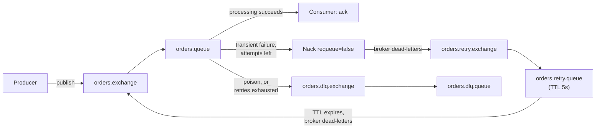

# Event-Driven Pipeline Skeleton

A small .NET producer/consumer pair around RabbitMQ (standing in locally for
Azure Service Bus) that demonstrates three patterns hand-rolled rather than
handed to a framework: **retry with backoff**, **dead-lettering**, and
**idempotent consumption**. No business domain to speak of — one
`OrderPlaced` event, entirely in service of showing how the plumbing works.

## The three patterns

**Retry with backoff.** RabbitMQ has no native delayed delivery, so the
retry delay is a queue trick: `orders.queue` dead-letters a `Nack`ed message
into `orders.retry.queue`, which holds it for a fixed TTL (`x-message-ttl`)
and then dead-letters it *again* — this time back onto the main exchange.
One retry queue, one wait, then reprocessed. RabbitMQ tracks how many times a
message has been dead-lettered in its `x-death` header automatically; the
consumer reads that count instead of maintaining its own.

**Dead-lettering.** Two different paths land in `orders.dlq.queue`. A
transient failure that's exhausted `MaxAttempts` (3) gets dead-lettered by
the consumer explicitly. A failure the consumer *knows* can't be fixed by
retrying (`PoisonMessageException` — bad data, a validation failure) skips
the retry loop entirely and dead-letters on the first attempt, rather than
burning three attempts and 10+ seconds to learn what attempt one already
knew.

**Idempotent consumption.** Every processed message id is recorded in a
SQLite table before the message is acked, not an in-memory set — a redelivery
after the consumer process itself crashes and restarts is exactly when
idempotency has to work, and an in-memory set forgets everything on restart.
A duplicate delivery is acked and skipped without reprocessing.

## Topology



## Verification

The .NET SDK wasn't available in the sandbox this repo was built in, so the
C# itself is carefully written and reviewed but not compiler-verified — run
`dotnet build` locally before trusting it in CI. What *was* verified for
real: this exact exchange/queue topology, declared and driven from a
throwaway Python/pika script against a live RabbitMQ 3.12 broker, confirming
— with real messages, not a thought experiment — that a transient failure
retries and recovers, that a transient failure exceeding `MaxAttempts` is
dead-lettered, that a poison message dead-letters immediately with zero
retries, and that a duplicate message id is skipped. The C# consumer's
control flow (`OrderProcessor` → catch by exception type → `Ack` /
`Nack(requeue: false)` / publish-to-DLQ) is a direct translation of that
verified logic, not a from-scratch guess.

## Running it

```bash
docker compose up --build
```

Or, faster while iterating on the .NET code:

```bash
./scripts/run_local.sh
```

Watch it work via the RabbitMQ management UI at `http://localhost:15672`
(guest/guest) — queue depths on `orders.queue`, `orders.retry.queue`, and
`orders.dlq.queue` tell the story as messages move through, or just read the
consumer's console output: `[retry]`, `[exhausted]`, `[poison]`, and `[dup]`
lines are each one of the four scenarios the producer seeds on every run.

## What I'd do differently

One retry queue with a fixed 5s TTL, not escalating backoff (5s, then 30s,
then 5min) — that needs one retry queue per backoff stage, which is the
standard next step and a small, mechanical extension of what's here. The
idempotency store's check-then-insert also assumes one consumer thread; a
deployment with concurrent consumers would need to make the insert itself
the race-safe step rather than trusting the read that came before it.

## Layout

```
src/
  EventPipeline.Contracts/   OrderPlacedEvent, RabbitTopology (shared by both)
  EventPipeline.Producer/    seeds a mixed scenario: ok, transient_fail, permanent_fail, one duplicate
  EventPipeline.Consumer/    IdempotencyStore (SQLite) + OrderProcessor + the retry/DLQ control flow
docker-compose.yml        RabbitMQ (management image) + both services
scripts/run_local.sh      RabbitMQ in Docker, producer/consumer run locally via `dotnet run`
```
